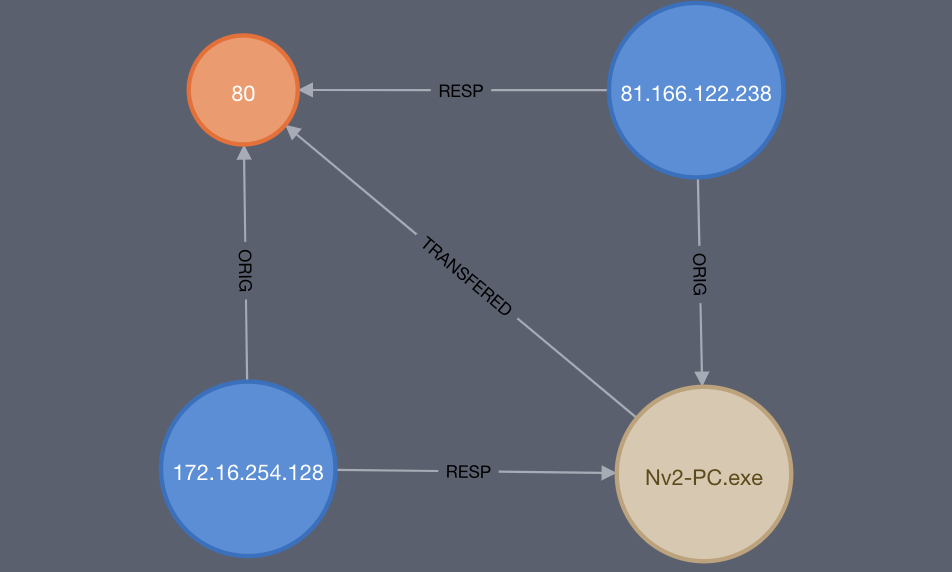
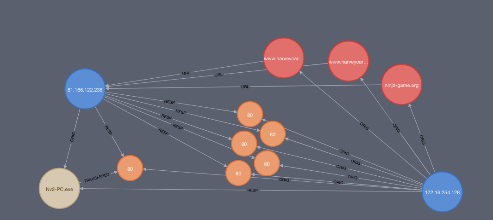
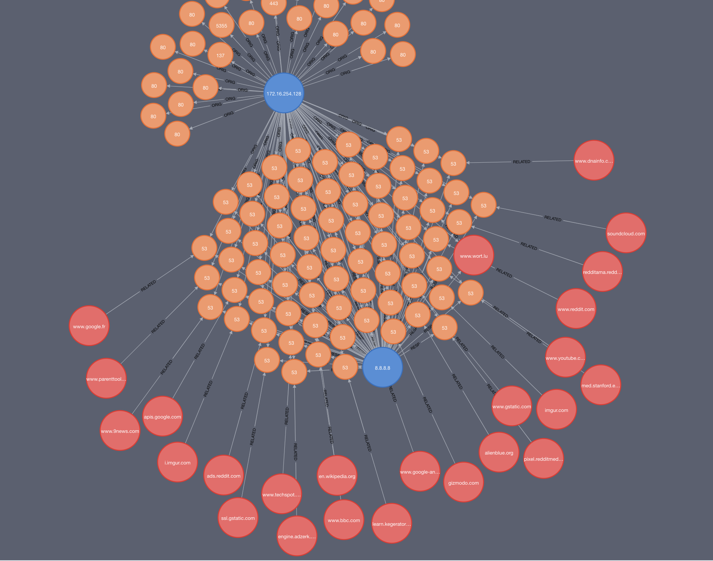
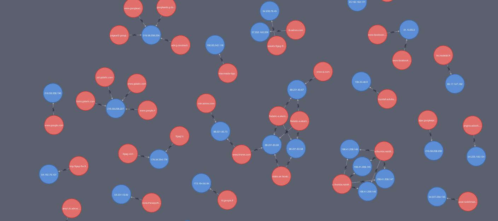
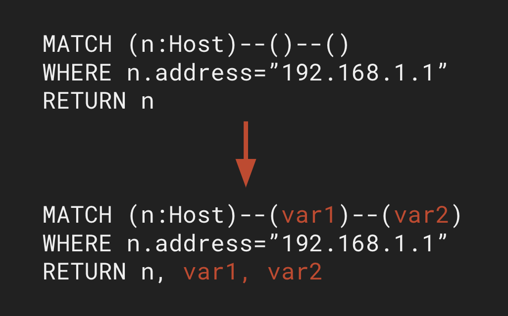

# Neht Graff
New Efficient Hunting Technique  Graph Relational Analysis Fancy Forensics

A full-stack web application for visualizing force directed graphs with Neo4j and D3.js.

Currently still rough and not ready for a production situation, but ready for the analyst to use. 

# Example Usage 
NODES and RELATIONSHIPS:


You can map a FULL NETFLOW: 


You can do lots of NODES: 


You can map DNS to ANSWERS:



## Start Guide
Start Neo4j docker container and upload data with upload.py. In upload.py some basic constraints are enabled 
and example relationships that can be expressed in the data base. To get examples like above you will need to 
add some more relationships using [cypher query language](https://neo4j.com/docs/cypher-refcard/current/). 

TODO Add detailed explanation for designing schema and uploading logs.

2. Configure the following environment variables:

|      Name      |                                    Expected Value                                   |
|:--------------:|:-----------------------------------------------------------------------------------:|
|   NEO4J_USER   |                           Username of existing Neo4j user                           |
| NEO4J_PASSWORD |                           Password of existing Neo4j user                           |
|    NEO4J_URI   | URI for Neo4j.  Port is typically 7687, or the corresponding port exposed by docker |

Navigate to http://localhost:8080 in a browser, or run the electron app.

## Components
### Neo4j
A graph database which uses logs to build a series of nodes and relationships based on the specified schema.

Recommended options for setup are the [Neo4j Desktop Installer](https://neo4j.com/download/) 
or the [official Neo4j Docker container](https://hub.docker.com/_/neo4j)

Neo4j exposes three ports by default: 
* `7473` HTTPS
* `7474` HTTP
* `7687` Bolt

The Flask server uses Bolt to communicate with Neo4j, so the configured 
NEO4J_URI should specify 7687 or the corresponding Docker port.

### Flask Server
Queries submitted to the web interface are validated, refactored, and submitted to Neo4j by the Flask server.

On submission, Flask will send a query to the Neo4j instance to check for syntax errors.
If an error is returned, the error message will be displayed in the web interface as an alert.

If the query is valid, Neo4j will refactor the query to ensure all graph in the query are returned in the result.

```
()      = (var#)
(:Type) = (var#:Type)
--      = -[var#]-
-[]-    = -[var#]-
```


 
The refactored query is submitted to Neo4j, and a successful result will be parsed into JSON.
The following JSON represents two nodes with a directed relationship from Node 1 to Node 2.

```json
{
    "nodes": [
        {
            "id": 1,
            "labels": [
                "label"
            ],
            "properties": {
                "property": "value"
            }
        },
        {
            "id": 2,
            "labels": [
                "label"
            ],
            "properties": {
                "property": "value"
            }
        }
    ],
    "paths": [
        {
            "id": 3,
            "source": 1,
            "target": 2,
            "type": "relationship type"
        }
    ]
}
```

 The JSON will either be assigned to a JavaScript variable when the visualization is 
 refreshed, or sent as the payload in an HTTP response.
 This depends on the method of query submission from the web interface, which will be discussed in detail below.
 
### Web Interface
 Visualizes nodes and relationships with a force-directed graph using D3.js
 
#### Important Elements
##### The Graph SVG - `<svg id='graphSvg'></svg>`
Used as a container for all elements of the visualization.

Contains element groups encapsulating nodes, links, text, and more.

Graph-wide transformations(zoom, pan) are performed on the Graph SVG.

##### The Interface Grid - `<section id='interfaceGrid'>`
Contains all interface elements excluding the tooltip, 
such as the primary query bar, visualization statistics, and legend.

New interface elements should be added here and positioned using the CSS grid.

##### The Tooltip - `<div class='tooltipContainer'>`
Encapsulates all tooltip elements.  

When a node is clicked, the tooltip will appear at the 
position of the click event. Additionally, the tooltip buttons
will be assigned to the clicked node.

##### Tooltip buttons:
###### Pivot 
Automatically submits the following query and adds 
the results to the current visualization.

```
MATCH (v1)-[v2]-(v3) 
WHERE ID(v1)=NODE_ID 
RETURN v1, v2, v3 LIMIT 50
```

This queries all nodes with a direct relationship to the subject
of the pivot, returning the first 50 results.

###### Unpin
Removes the 'fixed' property of the selected node,
reintroducing interaction with the various forces of the
simulation.

###### Sub Query
Displays a secondary query bar at the top of the tooltip.

Query results from this bar will be added to the current visualization.

 
## Handling New Data


## File Structure 
```
config.py - constant variables for Flask and Neo4j configuration.  Uses environment variables by default.
CYPHER_SUPPORT.md - details which Cypher clauses are accepted
flask_server.py - defines http responses, submits queries to Neo4j
upload.py - uploads logs to Neo4j

data - contains JSON representation of the most recent query result

electron - all resources for electron application
    config - contains config.json with the configured Flask server address
    static - web resources
        html
            config_window.html - startup config window html
        js
            browser_windows - contains scripts for each browser window type
            window.js - contains Window and WebWindow classes for use by main.js
        styles
            config_window.css - startup config window style
    main.js - electron main process dealing with file I/O and opening browser windows
    

neo4j_utils - python modules for parsing queries and query results
    query_refactoring.py - rebuilds queries to return all objects in Cypher clause
    result_parsing.py - parses query results from Neo4j into JSON

static - web resources
    js - JavaScript
        graph.js - primary d3.js visualization
        link_params.js - functions defining visual parameters for relationship types
        node_params.js - functions defining visual parameters for node types
        node_selection.js - functions for selecting and interacting with svg nodes
        tooltip.js - functions for rendering and positioning the tooltip
    styles - CSS Stylesheets
        graph.css - Primary stylesheet for graph.html
    images - image files for README.md and visualization icons

templates - Jinja2 html templates
    graph.html - Front-end/visualization

test - testing functions
    query_test.py - automates query submission with requests to avoid manual entry in the web interface
```

## Electron App
To run the electron app for development, navigate to `/electron` and run `npm start` 

## TODO 
    Generate legend based on link types
    Update log path imports to be taken from the configuration file
